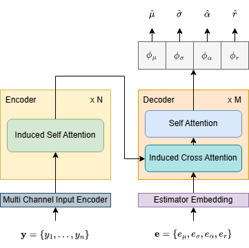

# EstiFormer
In this repository, we provide the code and model checkpoint for our paper: 

__A Skewed Generalized Normal Distribution Based on $\gamma$-order Normal Distribution__.

In the contemporary landscape of big data, many datasets exhibit asymmetric, leptokurtic and heavy-tailed characteristics. Modeling those kinds of data has significant challenges, particularly when dealing with data that is extremely skewed and characterized by high kurtosis or heavy tails. In response, we introduce a novel class of the skewed generalized normal (SGN) distribution. This family of distribution is constructed by incorporating a parameter $r$ into the $\gamma$-ordered normal distribution, which effectively enables the capture of skewness. The proposed SGN distribution demonstrates excellent adaptability across various datasets, owing to its capacity to accommodate a wide range of skewness and kurtosis. We derive key theoretical properties of the SGN distribution, followed by moments estimation and maximum likelihood estimation. Finally, we present a simulation study and practical applications to illustrate the effectiveness of our proposed approach. 



To make the proposed SGN distribution more accessible, we provide pretrained a model named EstiFormer, which can be used to estimate the parameters of the SGN distribution. The EstiFormer model is based on the Transformer architecture and is trained on a large dataset of synthetic SGN distributions. The code and model checkpoint for the EstiFormer model are available in this repository.

## Requirements
- Python 3.6+
- PyTorch 2.1.2+
- NumPy 1.24.4+
- safetensors 0.4.2+


## Tutorial
To use the EstiFormer model, you can follow the steps below:

1. Clone the repository:
```bash
git clone https://github.com/wangxuehlj/EstiFormer.git
cd EstiFormer
```

2. Install the required packages:
```bash
pip install -r requirements.txt
```

3. Load the EstiFormer model and make prediction:
```python
import torch
from model import EstiFormer
# Load the EstiFormer model checkpoint
model = EstiFormer.from_pretrained('./ckpt/estiformer_base/')
device = "cuda:0" if torch.cuda.is_available() else "cpu"
model.to(device).eval()

# Load sample data
ground_truth_theta = [0.0, 1.0, 2.0, 0.0]
y = [ float(x.strip()) for x in open('./EstiFormer/example_data/sample.txt','r').readlines()]
y = torch.FloatTensor(y).to(device).unsqueeze(0)

# Make prediction
with torch.no_grad():
    print(model(y).view(-1))
    # tensor([ 0.0027,  0.9974,  2.0150, -0.0145])
```

## Citation
If you find this repository helpful, please consider citing our paper:
